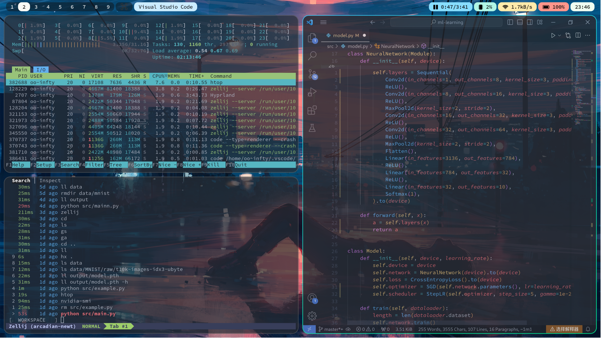

## NixOS Configurations

### Structure

```plain
.
├── global
│   ├── override
│   │   └── ...
│   ├── constants.nix
│   ├── flags-def.nix
│   └── flags.nix
├── home
│   ├── configurations
│   │   ├── default.nix
│   │   └── ...
│   ├── scripts
│   │   ├── executables
│   │   │   └── ...
│   │   ├── utilities
│   │   │   └── ...
│   │   └── default.nix
│   └── default.nix
├── modules
│   └── ...
├── system
│   └── ...
├── flake.lock
├── flake.nix
├── Makefile
├── README.md
└── ...
```

A brief explanation of the structure of this repository is presented below:

- `flake.nix`: root of the whole flake, containing some fundamental information
- `global`: configurations that accessible to the whole flake
  - `override`: system-specific values which override the global settings
  - `constants.nix`: essential constants that will almost never change
  - `flags-def.nix`: definitions of high-level variables in charge of other configurtions and common behaviors
  - `flags.nix`: values of flags
- `home`: all essential files and configurations in $HOME
  - `configurations`: configurations of all software and some related files grouped by directories
  - `scripts`: some scripts less related to a specific program (mainly used by `zsh`)
    - `executables`: scripts that are directly executed by users or other programs
    - `utilities`: scripts that provide some useful functions or variables
- `modules`: common modules for building a NixOS system
- `system`: specific configurations for each particular computer

### Screenshots



